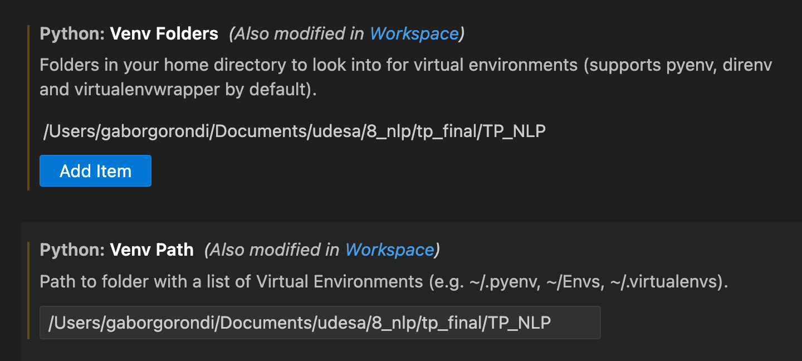

## Verificación Automática de Contradicciones Judiciales con RAG
# TP_NLP
INSTALANDO EL PROYECTO
Pueeden hacer desde cualquier entorno nuevo de python:
         pip install -r requirements.txt 
         Y con eso se instalan las librerias necesarias para correr todo el proyecto. A medida que agreguemos más, estaría bueno ir completando el .txt ese asi es facil hacer el setup del proyecto en cualquier lugar.

# Correr los archivos numerados en el orden correspondiente
0. Antes de correr código, descargar la carpeta de toni y colocarla dentro de la carpeta `datasets` con el nombre `2024`. También se debe crear un archivo credentials_config.py en la carpeta configs, siguiendo el template de template_config.py con las credenciales personales de Azure.
<br><br>También mirar sección de cómo armar el env de python

1. **1_normalization.ipynb**: 
   - Normaliza los textos de los fallos judiciales.
   - los croppea y elimina datos irrelevantes.
   - devuelve una carpeta con los jsons de los fallos dados
2. **2_embeddings.ipynb**: 
   - Crear archivo en configs con datos de la API.
   - Seleccionar los parametros
   - Crea los embeddings de los textos de los fallos judiciales.
   - Utiliza la librería `sentence_transformers` para generar representaciones vectoriales de los textos.

# Notas
- esta la clase tutorial de RAG aca para usar de referencia
- el flujo actual solo carga los fallos de febrero, son 10.

# Notas para armar el python env (venv)

1. **En terminal: crear el venv, activarlo**

   ```bash
   cd Su/Path/a/TP_NLP

   python3.11 -m venv nlp_venv      # Crea venv (equivalente a "conda create -n nlp_venv").
   ```
   Con 3.11 y 3.13 probado funciona. Si no las tienen y quieren probar otra pueden probar suerte.

   ```bash
   # # # en mac: # # #
   source nlp_venv/bin/activate        # activa el venv (equivalente a hacer "conda activate nlp_venv") 

   # # # en Windows: # # #
   .\nlp_venv\Scripts\activate
   ```

2. **En terminal: con el venv activado, instalar dependencias**

   ```bash
   # con el nlp_venv activo (hacer paso 1):
   pip install --upgrade pip
   pip install -r requirements_nlp_venv.txt
   ```


3.  **Si no les aparece el kernel del venv en el dropdown de vscode para correr el ipynb**
   - Tienen que agregar el path al directorio donde esta el venv a los configs de vscode:
   - Van a Code > Settings > Settings, buscan 'venv' en el buscador y agregan Su/Path/a/TP_NLP a las configs relevantes, que son "Python: Venv Folders", y "Python: Venv Path"
   <br>


4. **Para desactivar venv**
  
   ```bash
   # Si quieren desactivar el venv en la terminal:
   deactivate           # Equivalente a "conda deactivate"

   # Para usarlo en el futuro simplemente:
   cd Su/Path/a/TP_NLP
   source nlp_venv/bin/activate     # "conda activate nlp_venv"
   ```
